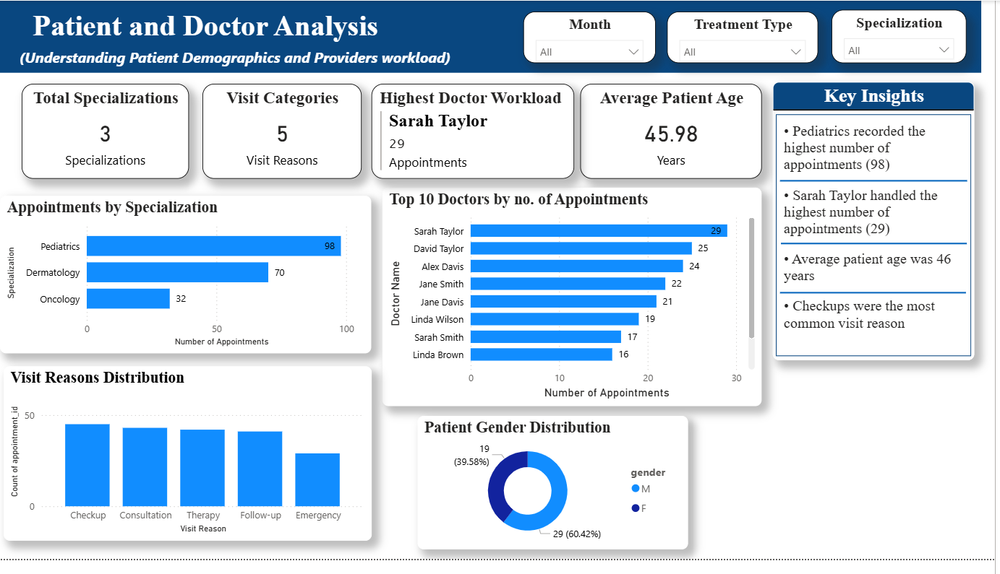
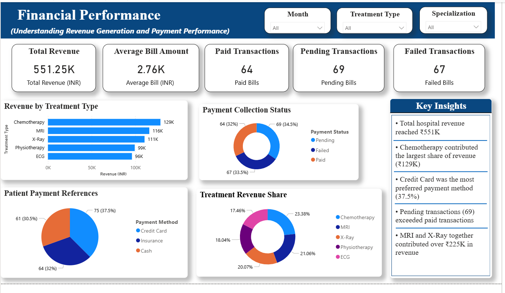

# Healthcare-Analytics-Dashboard

## Project Overview

This project analyzes hospital operations, patient demand, doctor performance, treatment revenue, and financial performance using SQL, Python, and Power BI.

The objective is to transform healthcare data into actionable insights that support operational efficiency, resource planning, and revenue optimization.

---

## Tools & Technologies

* SQL
* Python
* Pandas
* NumPy
* Matplotlib
* Seaborn
* Power BI
* GitHub

---

## Business Questions

This project answers the following healthcare analytics questions:

* How many patients and appointments were handled?
* Which medical specializations received the highest demand?
* Which doctors managed the highest appointment workloads?
* What are the most common visit reasons?
* Which treatments generated the highest revenue?
* How do payment methods and payment status impact financial performance?
* Which areas present opportunities for operational improvement?

---

## Project Workflow

### 1. Data Preparation

* Imported and cleaned healthcare datasets.
* Verified data quality and consistency.
* Created derived metrics and KPIs.
* Prepared data for SQL analysis, Python EDA, and Power BI reporting.

### 2. SQL Analysis

Performed healthcare business analysis using SQL:

* Total Patients
* Total Appointments
* Revenue Analysis
* Doctor Performance Analysis
* Appointment Status Analysis
* Treatment Revenue Analysis
* Specialization Analysis
* Payment Method Analysis
* Payment Status Analysis

### 3. Python Exploratory Data Analysis (EDA)

Performed exploratory analysis using Python:

* Appointment Trends
* Revenue by Treatment Type
* Patient Demographics
* Doctor Workload Analysis
* Appointment Status Distribution
* Payment Analysis
* Financial Performance Analysis

### 4. Power BI Dashboard

Built an interactive three-page dashboard.

#### Executive Summary

Provides a high-level overview of:

* Total Patients
* Total Appointments
* Total Revenue
* Active Doctors
* Monthly Appointment Trends
* Revenue by Treatment Type

#### Patient & Doctor Analysis

Focuses on:

* Patient Demographics
* Average Patient Age
* Doctor Workload
* Specialization Performance
* Visit Reason Analysis
* Gender Distribution

#### Financial Performance Analysis

Analyzes:

* Revenue Performance
* Payment Methods
* Payment Status
* Treatment Profitability
* Financial KPIs

---

## Key Insights

### Patient Demand

* Pediatrics recorded the highest number of appointments.
* Checkups were the most common patient visit reason.
* Average patient age was approximately 46 years.

### Doctor Performance

* Sarah Taylor handled the highest number of appointments.
* Doctor workloads varied significantly across specializations.
* Pediatric specialists experienced the greatest patient demand.

### Treatment Performance

* Chemotherapy generated the highest treatment revenue.
* MRI and X-Ray services were major revenue contributors.
* Treatment profitability varied across service types.

### Financial Performance

* Total revenue exceeded ₹551K.
* Credit Card was the most preferred payment method.
* Pending payments slightly exceeded paid bills.
* Revenue generation was concentrated among a small number of treatment categories.

---

## Dashboard Screenshots

### Executive Summary

### Patient & Doctor Analysis

### Financial Performance Analysis

---

## Repository Structure

Healthcare-Analytics-Dashboard

├── Dataset

├── SQL

├── Python

├── Dashboard

└── README.md

---

## Skills Demonstrated

* Data Cleaning
* Exploratory Data Analysis (EDA)
* SQL Querying
* Data Visualization
* KPI Development
* DAX Measures
* Healthcare Analytics
* Business Intelligence
* Dashboard Design
* Data Storytelling

---

## Author

**Himanshi Jain**

MSc Biotechnology | Aspiring Data Analyst

Interested in Healthcare Analytics, Business Intelligence, SQL, Python, Power BI, and Data-Driven Decision Making.

